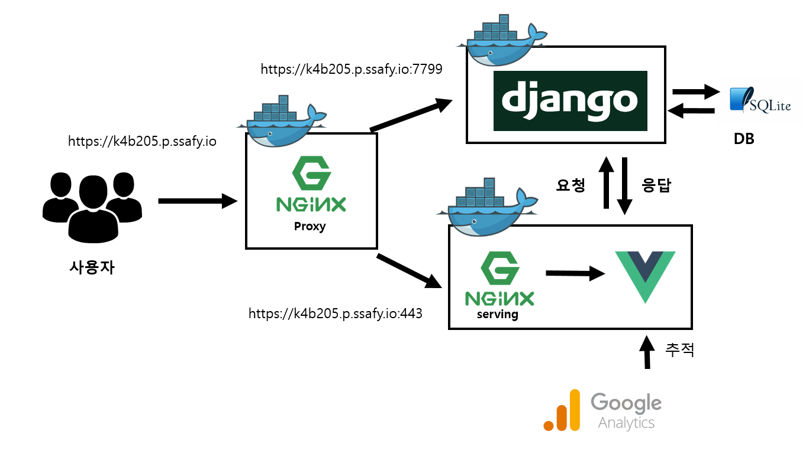

# Welcome to 모가코!
## 서비스 소개
모가코는 개발 스터디 지원 서비스입니다.
## 🏠 [Homepage](https://k4b205.p.ssafy.io/)
- **[API list](https://k4b205.p.ssafy.io:7799/swagger/)**

## ⭐️ 주요 기능
- **개발자 스터디 지원**

## 📆 프로젝트 개요

- **진행 기간**: 
	- sub-final: 2021.04.12 ~ 2021.05.28

- **목표**:  
	- "스터디"를 통해 함께 학습하며 성장할 수 있게 도움을 주는 플랫폼을 만들자!!!
  


## 📒 Tech Log
### 🔧 Tech Stack
- **Vue**
- **Django**
- **Docker**
- **Sqlite3**
- **Google Analytics**


## 서버 구성도


## ※주의 사항
- 로컬에서 실행시 frontend와 backend를 각각 실행해야합니다.
- 도커 실행은 SSAFY에서 지급 받은 저희 EC2 서버에서만 실행할수 있습니다
- 재배포 할때 마다 쿠키를 삭제 하셔야합니다.

# Frontend
#### frontend 실행 방법

## Project setup
```
npm install
```

### Compiles and hot-reloads for development
```
npm run serve
```

### Compiles and minifies for production
```
npm run build
```

### Lints and fixes files
```
npm run lint
```

### Customize configuration
See [Configuration Reference](https://cli.vuejs.org/config/).


### 코드 컨밴션

- Git

  - develop 밑에 branch 생성 
  - branch 명 feature/기능명 
  - commit 할때 'fe/기능명' 

- Front

  1. src/router/index.js는 git push x

  2. css 충돌 우려 때문에 vue파일 template의 맨 위 부모 div의 class명은 페이지 이름+"-container" 

  3. css 사용시

     .main-container #top { height:100px; } 
     .main-container #bottom {}
     )

  4. 컴퓨터 디스플레이, 크롬 배율 100%로 설정.


# Backend

#### backend 실행 방법

- step0. backend 폴더 클릭
- step1. 가상환경 구동

```bash
$ python -m venv venv       # 첫 venv 뒤의 venv에서는 가상환경 이름을 자유롭게 정의 가능합니다.
```

```bash
# 만들어진 가상환경을 활성화하는 과정입니다. 
$ source venv/Scripts/activate  # windows

$ source venv/bin/activate     # Mac / Linux
```

```bash
$ source venv/Scripts/activate     # 가상환경이 정상적으로 활성화되었습니다.
(venv) 
```

```bash
$ deactivate                # 가상환경 비활성화
```

- step2. 마이그레이션 진행

```bash
$ python manage.py makemigrations
```

```bash
$ python manage.py migrate
```

- step3. 서버 구동

```bash
$ python manage.py runserver
```


# Docker

#### Docker로  실행 방법

※주의 사항: SSAFY에서 제공한 팀 서버가 아니면 동작하지 않습니다 

- step1. 도커 설치

- step2. docker-compose.yml 실행
```bash
$ docker-compose up --build       
```

- step3. 현재 동작중인 컨테이너들의 상태를 확인할 수 있습니다.
```bash
$ docker-compose ps
```

- step4. 현재 동작중인 컨테이너들 모두 종료합니다
```bash
$ docker-compose down
```

## 팀원 소개

### backend

- 정대영 (BE, 팀장, 배포)
- 남현준 (BE, 기획, 발표)

### frontend

- 이현우 (FE, FE팀장)
- 김병수 (FE)
- 최주아(FE)


## 페이지

- 회원가입

- 로그인

- 메인페이지

- 모임페이지

  - 모음목록
  - 내모음관리
  - 지원마감
  - 진행중인 모임관리
  - 모임 공지사항

- 마이페이지

  